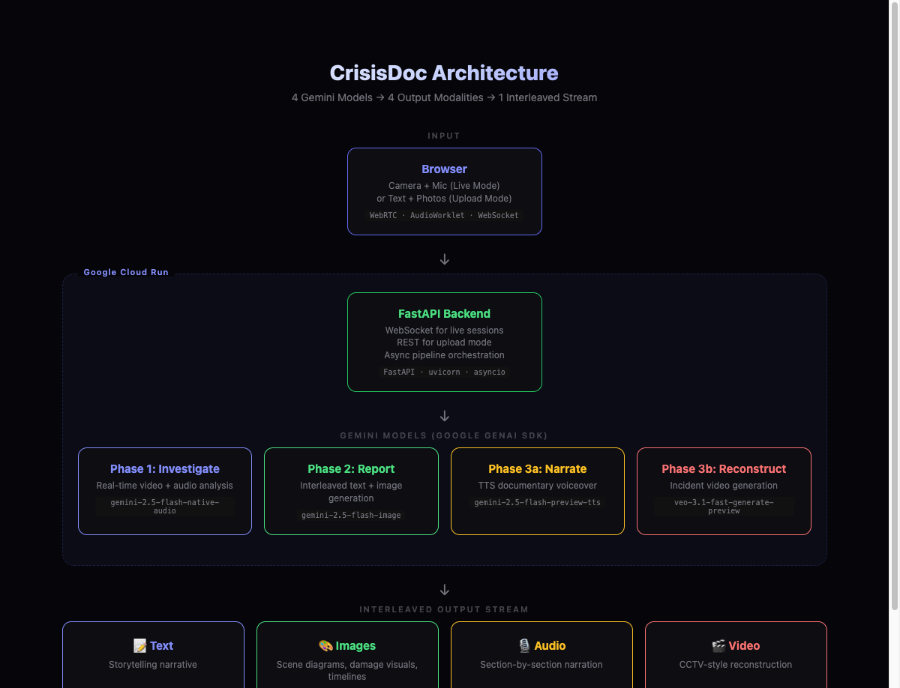

# CrisisDoc — AI Incident Report Generator

**Describe what happened. Upload photos. Get a complete multimedia report.**

CrisisDoc uses Google's Gemini AI to generate comprehensive incident reports with interleaved text narratives and AI-generated diagrams — turning a 3-4 hour manual process into minutes.



## Problem

Incident reports (workplace accidents, vehicle collisions, property damage) are critical for insurance claims, OSHA compliance, and legal proceedings. Yet:
- They take **3-4 hours** to write properly
- Are often **incomplete** or inconsistent
- Workplace injuries alone cost businesses **$170B/year** in the US

## Solution

CrisisDoc lets users describe an incident and upload photos. The AI then generates:
- **Scene diagrams** — top-down layout of the incident
- **Damage assessment visuals** — color-coded severity zones
- **Timeline diagrams** — sequence of events visualization
- **Complete narrative** — chronological, professional report text
- **Contributing factors & action items** — root cause analysis

All in one interleaved stream of text and images.

## Tech Stack

| Component | Technology |
|-----------|-----------|
| Frontend/Backend | Streamlit |
| AI (Report Generation) | Gemini image generation model (`response_modalities=['TEXT', 'IMAGE']`) |
| AI (Photo Analysis) | Gemini 2.0 Flash |
| SDK | Google GenAI SDK |
| Hosting | Google Cloud Run |
| Storage | Google Cloud Storage |
| Database | Firestore |
| IaC | Terraform |

## Setup

### Prerequisites
- Python 3.12+
- [Google Cloud SDK](https://cloud.google.com/sdk/docs/install)
- Gemini API key from [AI Studio](https://aistudio.google.com)

### Local Development

```bash
# Clone
git clone https://github.com/YOUR_USERNAME/crisisdoc.git
cd crisisdoc

# Create virtual environment
python3.12 -m venv venv
source venv/bin/activate

# Install dependencies
pip install -r requirements.txt

# Set environment variables
export GEMINI_API_KEY="your-api-key-here"
export GCP_PROJECT="your-gcp-project-id"       # optional for local
export GCS_BUCKET="your-bucket-name"            # optional for local

# Run
streamlit run app.py
```

### Deploy to Cloud Run

```bash
# Authenticate
gcloud auth login
gcloud config set project YOUR_PROJECT_ID

# Deploy (source-based, no Dockerfile needed)
gcloud run deploy crisisdoc \
  --source . \
  --region us-central1 \
  --allow-unauthenticated \
  --set-env-vars="GEMINI_API_KEY=your-key,GCP_PROJECT=your-project,GCS_BUCKET=your-bucket"
```

### Deploy with Terraform

```bash
cd terraform
terraform init
terraform plan -var="project_id=YOUR_PROJECT" -var="gemini_api_key=YOUR_KEY"
terraform apply -var="project_id=YOUR_PROJECT" -var="gemini_api_key=YOUR_KEY"
```

## How It Works

1. **User Input** — Describe the incident, select type, provide location/time, upload photos
2. **Photo Analysis** — Gemini 2.0 Flash analyzes uploaded photos for damage severity and key objects
3. **Report Generation** — Gemini image generation model generates a complete report with interleaved text sections and AI-generated diagrams using `response_modalities=['TEXT', 'IMAGE']`
4. **Storage** — Photos and generated assets saved to Cloud Storage; report metadata saved to Firestore
5. **Output** — Interactive report displayed with text, diagrams, severity badges, and download option

## Architecture

```
User (Browser)
    ↓ description + photos
Streamlit App (Cloud Run)
    ↓
┌─────────────────────────────────────┐
│  Step 1: Photo Analysis             │
│  Model: gemini-2.0-flash            │
│  → Structured damage assessment     │
├─────────────────────────────────────┤
│  Step 2: Report Generation          │
│  Model: gemini-*-image-generation   │
│  → Interleaved text + diagrams      │
└─────────────────────────────────────┘
    ↓                    ↓
Firestore            Cloud Storage
(report metadata)    (photos + images)
```

## Hackathon

Built for the **Gemini Live Agent Challenge** — Creative Storyteller category.

- Uses **Google GenAI SDK** for direct Gemini API access
- Leverages **interleaved text+image generation** — a unique Gemini capability
- Deployed on **Google Cloud Run** with **Terraform** IaC

## License

MIT
